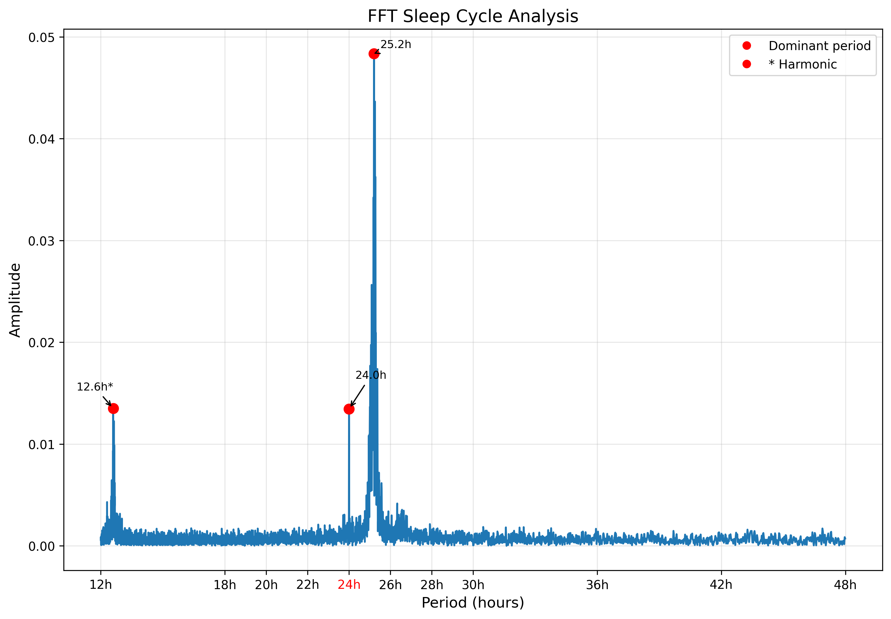
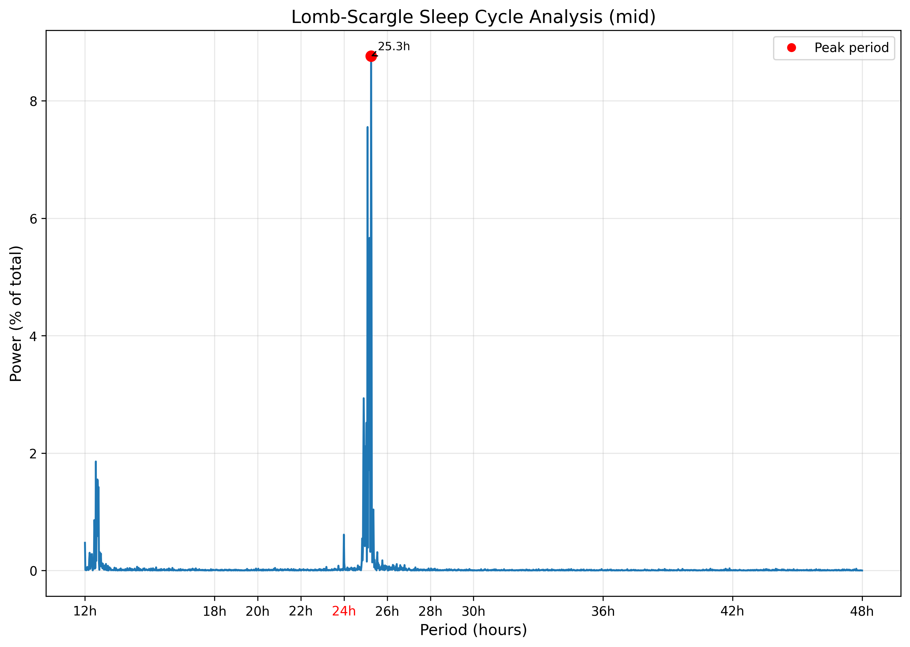

# Non-24 Sleep Cycle Analysis

Tools for analyzing sleep patterns to detect circadian rhythm period length, particularly useful for individuals with Non-24-Hour Sleep-Wake Disorder (Non-24). These scripts process sleep diary data to identify dominant periodic patterns in sleep-wake cycles using spectral analysis techniques.

Non-24 is a chronic circadian rhythm disorder where the internal body clock runs longer (or shorter) than 24 hours, causing sleep times to progressively shift later (or earlier) each day. These tools help quantify the intrinsic circadian period by analyzing historical sleep data, identifying the dominant cycle length and its statistical significance.

The project was a trial to see how useful FFT analysis could be in detecting Non-24 cycles and then adjusting the detected period length as new data was added. It works well at the former and can return acceptable results with only a couple weeks of sleep data. Of course, the accuracy and confidence will improve as more data is provided. However, this type of algorithm did not prove useful for adjusting results on a continuing basis as new data was included.

Provides two versions using different analysis algorithms with mostly the same input arguments and similar output fields. Both scripts can create PNG plots of the spectrum with dominant periods labeled or period results as either CSV or JSON (for use in the post-processing program of your choice). Period results are also printed to stdout along with status messages. The two scripts both do a good job at detecting period lengths, although there are some minor differences with how results are analyzed and presented that might make you want to choose one or the other. I generally prefer Lomb-Scargle, but you should test data with both before deciding which is best for you.

These scripts should only be used for scientific purposes. Although the results may give some indication of Non-24 status, they are not fully or widely tested and should not be solely used for medical diagnostics.

## Requirements

- Python 3.6+
- pandas
- numpy
- matplotlib
- scipy

Install dependencies:
```bash
pip install pandas numpy matplotlib scipy
```

## Input Data Format

Both scripts accept CSV files with sleep event data:
- First column: sleep start time
- Second column: sleep end time
- Headers are automatically detected and skipped if present
- Any date/time format (that pandas can parse) can be used

Example:
```csv
start,end
2024-01-01 23:30,2024-01-02 07:45
2024-01-03 00:15,2024-01-03 08:30
```

## Scripts

### FFT: non24_fft_analysis.py

Performs **Fast Fourier Transform (FFT)** analysis on sleep data. This script converts sleep events into a binary time series (1 = asleep, 0 = awake) at regular intervals, then applies FFT to detect periodic patterns.

**Key characteristics:**
- Resamples data to create evenly-spaced time series
- Applies Hann windowing and detrending before analysis
- Reports spectral entropy, signal-to-noise ratio (SNR), and spectral density
- Best suited when you have dense, regularly-occurring sleep data

#### Arguments

- `input_file`: Input CSV file with sleep data (required)
- `--sampling_interval`: Sampling interval in minutes for the binary time series (default: 15, range: 1-360). The default is fine for most data. Higher resolution gives diminishing returns on accuracy (more sleep data helps far more) while decreasing performance. Lower the interval if running on a very old computer with a very large dataset.
- `--min_peak_distance`: Minimum distance between detected peaks in hours (default: 0.5, range: 0-12)
- `--range_start`: Start date for analysis (optional, filters data)
- `--range_end`: End date for analysis (optional, filters data)
- `--output_dir`: Directory to save output files (default: `fft_analysis`)
- `-p`, `--plot`: Save results as a PNG graph
- `-c`, `--csv`: Save results as CSV files
- `-j`, `--json`: Save results as JSON files
- `-f`, `--write_full_data`: Include full FFT data in output (requires `-c` or `-j`)

#### Examples

Show a list of the input arguments only
```bash
python non24_fft_analysis.py
```

Output both a PNG plot and CSV results with a sampling interval of 10 minutes
```bash
python non24_fft_analysis.py sleep_data.csv -pc --sampling_interval 10
```

#### Output

##### Dominant Periods (array of detected peaks)

- **period_hours**: The detected cycle length in hours (e.g., 25.2 means sleep shifts ~1.2 hours later each day)
- **amplitude**: Raw amplitude of the frequency component from the FFT
- **normalized_amplitude_percent**: Amplitude as a percentage of the strongest peak (strongest peak = 100%)
- **spectral_density_percent**: Percentage of total spectral power contained in this peak's cluster. Higher values indicate a more dominant, well-defined rhythm
- **spectral_width_hours**: Width of the spectral cluster around this peak in hours. Narrower widths indicate a more stable, consistent rhythm
- **spectral_width_range.start_hours**: Lower bound of the spectral cluster (hours)
- **spectral_width_range.end_hours**: Upper bound of the spectral cluster (hours)
- **fwhm_hours**: Full Width at Half Maximum - the width of the peak at half its height. Narrower FWHM indicates a sharper, more precise periodicity
- **snr**: Signal-to-Noise Ratio - how much this peak stands out from background noise. Higher values indicate a clearer signal
- **is_harmonic**: Whether this peak is likely a harmonic (mathematical artifact) of another stronger peak
- **harmonic_of_hours**: If harmonic, the period of the fundamental frequency this is derived from
- **harmonic_fraction**: If harmonic, the ratio to the fundamental (e.g., 0.5 = half the period, 2 = double)

##### Analysis Parameters

- **noise_floor**: Baseline amplitude level of the noise in the spectrum
- **amplitude_threshold**: Minimum amplitude used to identify significant peaks
- **spectral_entropy**: Measure of disorder in the spectrum (see interpretation below)

###### Spectral Entropy Interpretation

Spectral entropy measures how organized vs. chaotic the sleep pattern is on a logarithmic scale:

| Value | Interpretation |
|-------|----------------|
| < 0.50 | Near-perfect periodicity - extremely regular sleep pattern |
| 0.50 - 0.75 | Very ordered - strong, consistent rhythm |
| 0.75 - 0.90 | Somewhat chaotic - rhythm present but variable |
| 0.90 - 0.95 | Very noisy - may still have detectable peaks but with significant irregularity |
| > 0.95 | Essentially random - no clear periodic pattern |

#### Example Plot



---

### Lomb-Scargle: non24_ls_analysis.py

Performs **Lomb-Scargle periodogram** analysis on sleep data. Unlike FFT, this method works directly with timestamps without requiring resampling, making it better suited for irregularly-spaced or sparse data.

**Key characteristics:**
- Analyzes timestamps directly without resampling
- Can analyze sleep start, end, or midpoint times
- Reports statistical confidence levels using false alarm probability
- Better handles gaps and irregular sleep patterns
- Faster than FFT and produces less noise overall
- More susceptible to harmonics when sample count is low

#### Arguments

- `input_file`: Input CSV file with sleep data (required)
- `--endpoint`: Which point in sleep events to analyze: `mid` (midpoint), `start`, or `end` (default: `mid`)
- `--min_peak_distance`: Minimum distance between detected peaks in hours (default: 0.5, range: 0-12)
- `--range_start`: Start date for analysis (optional, filters data)
- `--range_end`: End date for analysis (optional, filters data)
- `--output_dir`: Directory to save output files (default: `lomb_scargle_analysis`)
- `-p`, `--plot`: Save results as a PNG graph
- `-c`, `--csv`: Save results as CSV files
- `-j`, `--json`: Save results as JSON files
- `-f`, `--write_full_data`: Include full periodogram data in output (requires `-c` or `-j`)

#### Examples

Output only JSON results and set the analysis to use start times instead of midpoints
```bash
python non24_ls_analysis.py "D:\Desktop\sleep stuff\sleep_data.csv" -j --endpoint start
```

Output JSON with the full plot data for use in another script
```bash
python non24_ls_analysis.py sleep_data.csv -jf
```

Output only JSON piped into another script for interpretation/output
```bash
python non24_ls_analysis.py sleep_data.csv -jf | another_script.py
```

#### Output

##### Dominant Periods (array of detected peaks)

- **period_hours**: The detected cycle length in hours
- **peak_power_percent**: Power at the peak as a percentage of total spectral power
- **cluster_power_percent**: Total power in the cluster around this peak. Higher values indicate this rhythm dominates the sleep pattern
- **cluster_range.start_hours**: Lower bound of the power cluster (hours)
- **cluster_range.end_hours**: Upper bound of the power cluster (hours)
- **fwhm_hours**: Full Width at Half Maximum - width of the peak at half its height
- **confidence_percent**: Statistical confidence that this peak is real and not due to chance (based on false alarm probability). Values near 99.99% indicate very high certainty
- **is_harmonic**: Whether this peak is likely a harmonic of another stronger peak
- **harmonic_of**: If harmonic, the period of the fundamental frequency
- **harmonic_fraction**: If harmonic, the ratio to the fundamental

#### Example Plot



## Interpreting Results

Both scripts analyze the 12-48 hour period range and report dominant peaks:

- **A strong peak near 24 hours** suggests a typical circadian rhythm
- **A strong peak above 24 hours** (e.g., 24.5-25.5h) suggests Non-24 with a longer-than-normal circadian period
- **A strong peak below 24 hours** suggests a shorter circadian period
- **Harmonics** (peaks at 1/2, 1/3, 2x, 3x the dominant period) are automatically detected and labeled - these are mathematical artifacts rather than real biological rhythms

**Indicators of reliable results:**
- High confidence (Lomb-Scargle) or high SNR (FFT)
- Narrow FWHM and spectral/cluster width
- High spectral density or cluster power percentage
- Low spectral entropy (FFT only)
